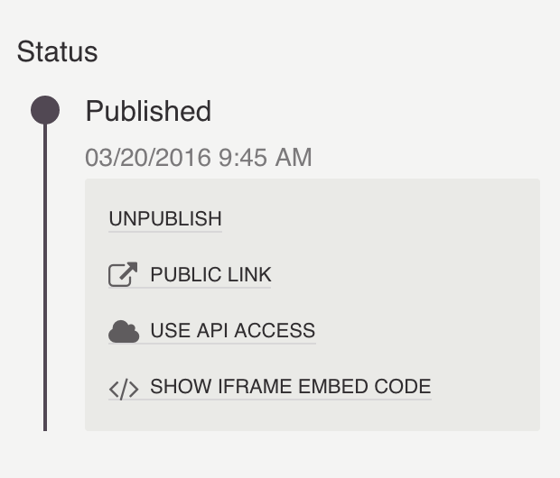
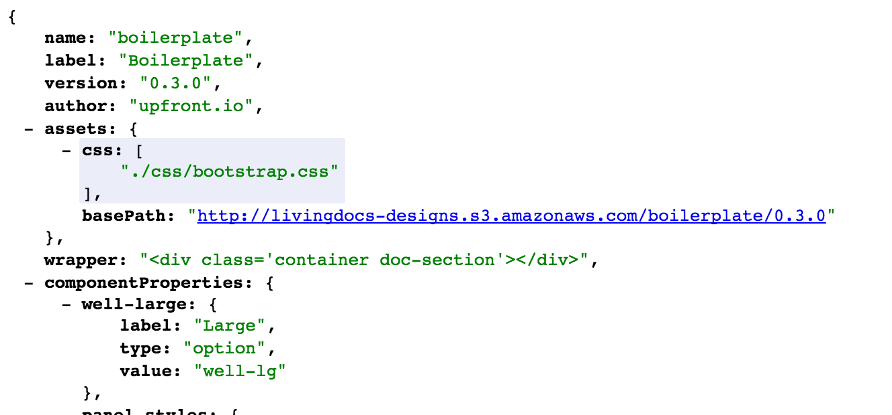

# Livingdocs REST API

## Overview

The essential parts in a frontend app are:
- getting the teaser data for frontpages or feeds
- getting the pre-rendered HTML for single documents
- loading the CSS design and a document's dependencies correctly

The following chapters will walk you through each of these tasks. If you're familiar with node.js you can also just use our [boilerplate app](https://github.com/upfrontIO/livingdocs-delivery) that we use ourselves to run our blog.

## A visual example

First lets see a result of the Livingdocs API. In your Livingdocs Beta account navigate to the publish panel. Once you published your document, you will get three links on the right-hand side of the screen: a preview, an API link and an Iframe embed code.



Click the "Use API access" link and you will get a new browser page with a JSON response. This is the API result for a single document.

## Getting a documents feed

In order to build a navigation, feed, or start page you need to get a list of all your documents and some information that allows you to render teasers for them. You can get this with a simple call to `http://api.livingdocs.io/public/publications`. The only required parameter to this call is the `project_id` which defines your account on Livingdocs Beta.

First get your project id id with a terminal command:

```bash
ldm user:info
```

With the project id you can create your query. Lets make an example:

```bash
curl http://api.livingdocs.io/public/publications?limit=10&project=your-project-id
```

This will get the 10 latest published documents from your Livingdocs Beta account. Easy, wasn't it.
And that's an example of what you get back:

```json
{
    "publications": [
        {
            "id": 3,
						"metadata": {
							"foo": "bar"
						},
            "design": {
							"name": "timeline",
							"version": "0.4.2"
						}
        }
    ]
}
```

- The `metadata` field contains structured publication-time information about a document. Typically, you use information from the `metadata` field for content that you require to be there, e.g., a title, and the Livingdocs document tree to get optional content, e.g., videos if there are any in the document.

You will most likely use the data within `metadata` to render a teaser for a document, e.g., using the title and teaser image.

Last but not last, here is the complete description of the `GET /public/publications` endpoint:

| Property      | Type    | Default  | Description
| ------------- | ------- | -------- | -------------
| `project_id`  | integer | -        | **required**, only get documents belonging to a project (shared account)
| `limit`       | integer | 50       | **optional**, used for pagination, how many results per page (offset)
| `offset`      | integer | 0        | **optional**, used for pagination, the page of the pagination that is returned
| `callback`    | string  | -        | **optional**, a callback function that gets called (jsonp), if you don't specify this you'll just get back a json response

## Getting a single document

Once you have your feed you will also want to be able to query a single document, e.g., to show a document's detail page.
The easiest option is to just use our Iframe embed code. You can see the Iframe embed code in the publish panel of an article. It has the following structure:
```
<div class="livingdocs-embed">  
	<a class="livingdocs-article-link" 		href="http://localhost:9090/articles/1.html?project_id=1"    data-article-id="1"
	data-project-id="1">foo</a>  
	<script src="http://localhost:9090/assets/livingdocs-embed.js"></script></div>
```
In order to embed an article in one of your HTML pages you can either copy the embed code for each article or you can generate the above snippet dynamically by inserting the correct values for the article id (data values).
The other option is to query a document through the REST API as you did before for a collection of documents. You can either get the id of a document from the Livingdocs editor in the publish panel (using the "use API access" link) or from a previous [document feed call](./api_essentials#getting-a-documents-feed). Once you have the id, simply call `GET http://api.Livingdocs.io/public/publications/:id` to get back the document's latest published version.

A response will look like the following:
```json
{
    "publication": {
        "id": 3,
        "channels": {
					"web": "<div>Document HTML</div>"
				},
        "metadata": {
					"foo": "bar"
				},
        "design": {
					"name": "timeline",
					"version": "0.4.2"
				}
    }
}
```

- The `channels` property contains rendered output for different channels. For the Beta service only the `web` channel is available which has HTML as a format.

You can simply place the whole rendered HTML within a placeholder in your page. In order for it to render correctly you will though also need to add the CSS and possible dependencies of the document to the page. The next chapters explain how to do this. If you embedded the article with our Iframe embed code you will not need to do this.

## Getting a document's design

At the very minimum each document requires the CSS files to be loaded that are defined in the respective Livingdocs design. You could hardcode the CSS `link` tags into your document but we advise you to dynamically parse the files from the API response. This has the advantage that you don't have to touch the frontend app every time you update the design to a newer version (Livingdocs handles the versioning for you and exposes the correct version with the API).

The design name and version of a single document are in `design`. For the host part you need to use the server where you uploaded the design (see [uploading a design](../design/upload.md)). At the moment, the only supported design server for the Livingdocs Beta account is ours, so your URL will most likely look like this: `http://api.livingdocs.io/designs/your-design-name/your-design-version` where you can plug in the name and version from the result you have in the API response in `design`.

The response from the URL above will give you the respective design definition in JSON. You will still need to get the CSS files out of this. The design definition defines a `basePath` and an array of CSS assets. For each entry in the css array concatenate it with the `basePath` and you have the full URL to the required css files. (NOTE: There might be more than one required CSS file depending on how the design was defined).



You might have realized that by adding the CSS dynamically, you can have documents running in different design versions on your frontend page. For some scenarios this is exactly what we want since we can update our design for new documents and everything just works. If you have a scenario where you always need to migrate all documents to the latest design version, check out chapter 5 about migrations.

HINT: If you integrate Livingdocs documents in a page where there are lots of other styles that could potentially clash, we made good experience by integrating the Livingdoc in an Iframe. Livingdocs already provides an Iframe embed code in the publish panel that you can use for this.

## Getting a document's dependencies

In addition to the design a document can have further CSS and Javascript dependencies. This happens for example when you embed a Tweet in your document (requires the Twitter Javascript). Those dependencies are added to the metadata section of the document. Check out `metadata/dependencies` for a document that has an embedded Tweet.

The following is a snippet of coffeescript code that gets you the Javascript and CSS dependencies from the `metadata` field.

```coffee
getDependencies = (metadata) ->
  jsCode = []
  jsUrls = []
  cssUrls = []
  cssCode = []
  for type, dependencies of metadata.dependencies
    continue if _.isEmpty(dependencies)
    if type == 'js'
     codeContainer = jsCode
     urlContainer = jsUrls
    else if type == 'css'
      codeContainer = cssCode
      urlContainer = cssUrls
    else
      console.error "Unknown dep type #{type}"

    for dependency in dependencies
      urlContainer.push(dependency.src) if dependency.src?
      codeContainer.push(dependency.code) if dependency.code?

  {jsCode, jsUrls, cssCode, cssUrls}
```

As you can see, dependencies can come as inline code or as a URL to a dependency file. Depending on the type you need to add those dependencies to the document as well to ensure proper rendering.

## The resrc.it dependency

Sorry, this part is still a glitch in our system: In every case you will need to add the resrc.it script to your page in order to render images properly. Resrc.it is a service we use to deliver responsive images, i.e., images optimized for the device width on which they are viewed. It is not contained in the `dependencies` nor anywhere else in the API response. You just have to know that it is there...

In your document before the end of the body tag, add the following snippet:
```javascript
<script src="//use.resrc.it/0.9"></script>
<script>
  // hack to make resrc.it work: https://github.com/upfrontIO/livingdocs-server/issues/155
  resrc.ready(function() {
    var matches = $('.resrc');
    for (var i=0; i<matches.length; i++) {
      try {
        resrc.run(matches[i]);
      } catch(e) {}
    }
  });
</script>
```

This rounds off the building of a simple frontend app. You can now get feeds of documents, single documents and load the required dependencies for correct rendering.
